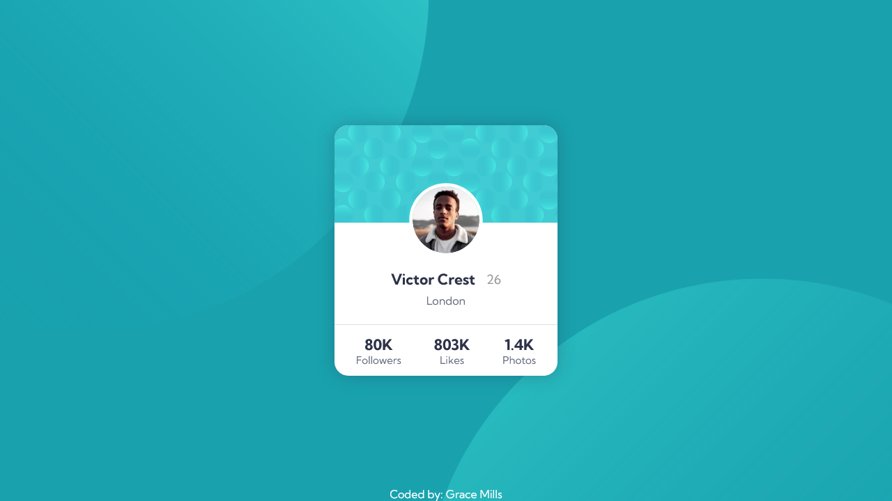

# Frontend Mentor - Profile Card Component Solution by Grace Mills

This is a solution to the [Profile card component challenge on Frontend Mentor](https://www.frontendmentor.io/challenges/profile-card-component-cfArpWshJ). Frontend Mentor challenges help you improve your coding skills by building realistic projects. 

## Table of Contents

- [Overview](#overview)
  - [The challenge](#the-challenge)
  - [Screenshot](#screenshot)
  - [Links](#links)
- [My process](#my-process)
  - [Built with](#built-with)
  - [What I learned](#what-i-learned)
  - [Continued development](#continued-development)
- [Author](#author)

## Overview

### The challenge

- Build out the project (a profile card component) to the designs provided
- The card component is currently responsive at 375px and 1440px screen sizes. 
  - Caveat: tested on Chrome with the responsive design function OFF in developer tools.

### Screenshot



### Links

- Solution URL: [https://github.com/codebygrace/FEM-profile-card](https://github.com/codebygrace/FEM-profile-card)
- Live Site URL: [https://codebygrace.github.io/FEM-profile-card](https://codebygrace.github.io/FEM-profile-card)

## My process

### Built with

- Semantic HTML5 markup
- CSS custom properties
- Flexbox

### What I learned

I didn't learn much new information while doing this challenge, but I did reinforce some knowledge about short-hand, especially for background properties. 

Below is an example of how I used the background shorthand to style the main background behind the actual card component:

```css
.container {
    flex-direction: column;
    justify-content: center;
    align-items: center;
    height: 100vh;
    background: url('./assets/bg-pattern-top.svg') -110% 150% no-repeat, url('./assets/bg-pattern-bottom.svg') 200% -60% no-repeat, linear-gradient(hsl(185, 75%, 39%), hsl(185, 75%, 39%));
}
```

### Continued development

In future projects (and this project, should I choose to revisit it), I would like to work on completely and consistently responsive code. I would also like to work on DRY (Don't Repeat Yourself) coding concepts because I did notice a few things that could be cut down or made into a single utility once I finished the challenge. I intend to come back and clean up said code and implement DRY coding concepts in the new future.

## Author

- Frontend Mentor - [@codebygrace](https://www.frontendmentor.io/profile/codebygrace)
- LinkedIn - [@codebygrace](https://www.linkedin.com/in/codebygrace)
- Instagram - [@code.bygrace](https://www.instagram.com/code.bygrace)
